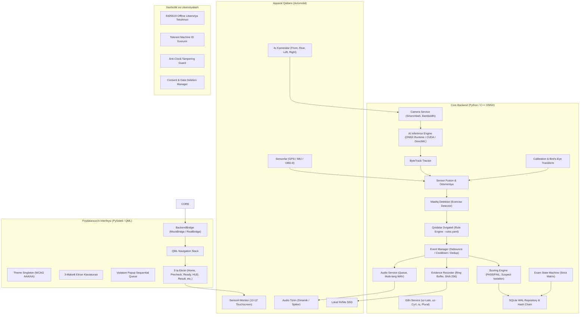
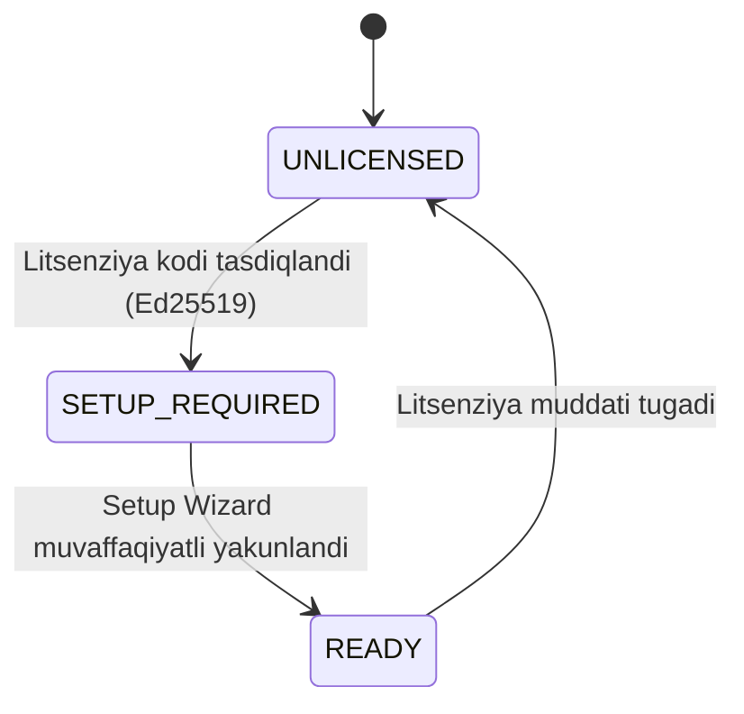
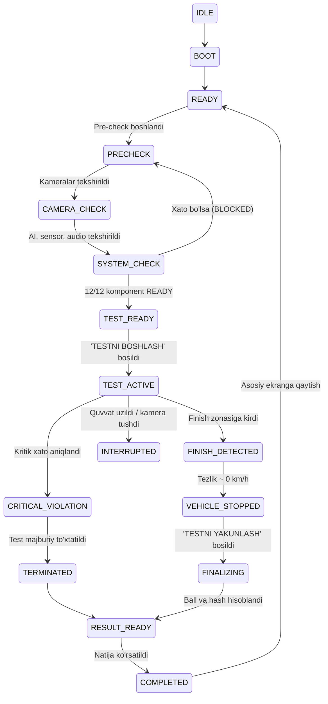
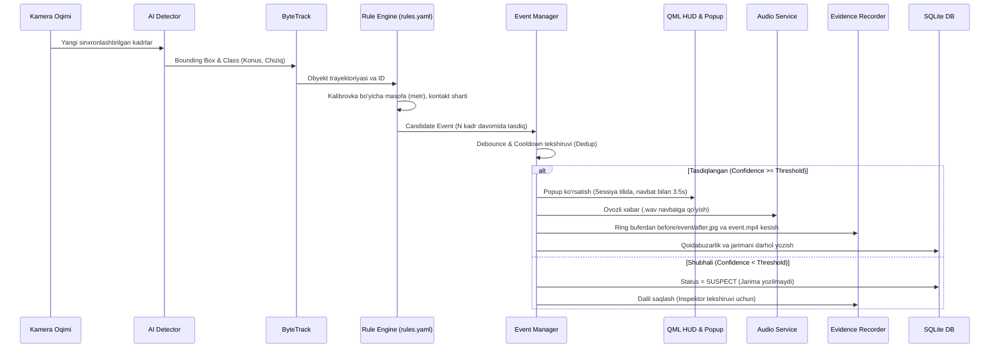

# MAHSULOT SPETSIFIKATSIYASI (SPEC.md)
## Offline 4-Camera AI Driving Training & Evaluation System

---

## 1. Umumiy Ma'lumot va Maqsad

"Offline 4-Camera AI Driving Training & Evaluation System" — bu avtomaktablar, imtihon markazlari va haydovchilarni tayyorlash poligonlari uchun mo'ljallangan, 100% offline, mustaqil va tarqatiladigan dasturiy-apparat majmuasidir.

Dastur nomzodning real avtomobilda poligon mashqlarini bajarishini 4 ta kamera (FRONT, REAR, LEFT, RIGHT), GPS, IMU va OBD-II telemetriyasi orqali real vaqtda tahlil qiladi, qoidabuzarliklarni yuqori aniqlikda (precision-first) aniqlaydi, sensorli monitorda ko'rsatadi, 3 tilda ovozda o'qib beradi, jarima hisoblaydi, dalillarni kriptografik zanjirda saqlaydi va yakuniy bahoni (PASS/FAIL) chiqaradi.

---

## 2. Tizim Arxitekturasi

---

## 3. Tizim Jarayonlari Xaritasi (State Machine)

### A. Dastur Darajasidagi Holatlar

### B. Imtihon Testi Darajasidagi Qat'iy Holatlar

---

## 4. Qoidabuzarlik Konveyeri (Violation Pipeline)

---

## 5. Ko'p Tillilik (i18n / l10n) Spetsifikatsiyasi

| Parametr | `uz-Latn` (Standart) | `uz-Cyrl` (Kirill) | `ru` (Rus) |
|---|---|---|---|
| **Alifbo** | Lotin (`oʻ`, `gʻ`, `sh`, `ch`) | Kirill (`ў`, `қ`, `ғ`, `ҳ`) | Rus kirill (`ё`, `ъ`, `ь`, `ы`, `э`) |
| **Matn uzunligi** | Bazaviy (100%) | ~100-105% | Kengaygan (+20-35%) |
| **Plural qoidalari** | 1 ta forma (N ball) | 1 ta forma (N балл) | 3 ta forma: 1 балл, 2 балла, 5 баллов |
| **Audio papkasi** | `data/audio/uz-Latn/` | `data/audio/uz-Cyrl/` | `data/audio/ru/` |
| **Ovoz formati** | 16-bit 44.1 kHz WAV | 16-bit 44.1 kHz WAV | 16-bit 44.1 kHz WAV |
| **Fallback tartibi** | XATO (Eng quyi asos) | `uz-Latn` -> XATO | `uz-Latn` -> XATO |
| **Installer (.isl)** | `uz-Latn.isl` | `uz-Cyrl.isl` | `Russian.isl` |
| **Klaviatura maketi** | QWERTY + `oʻ`, `gʻ` | ЙЦУКЕН + `ў`, `қ`, `ғ`, `ҳ` | ЙЦУКЕН (Standart) |

---

## 6. Risklar Reestri (Risk Register)

| Risk ID | Xavf Tavsifi | Ehtimollik | Ta'siri | Yumshatish Chorasi (Mitigation) |
|---|---|---|---|---|
| **R-01** | 4 ta USB kamera bitta host controllerga ulanib, bandwidth yetmasligi | Yuqori | Kritik | Setup Wizard'da controllerlar topologiyasini tekshirish, MJPEG apparatli siqish, pre-check bandwidth testi. |
| **R-02** | GPU bo'lmagan zaif kompyuterda AI kechikishi $\ge 150$ ms bo'lishi | O'rta | Yuqori | ONNX DirectML/CUDA talabi, pre-check paytida benchmark, past FPS da ASSESSMENT imtihonini bloklash. |
| **R-03** | Quyosh nuri tushganda yoki qorong'ida chiziq/konus ko'rinmasligi | O'rta | Yuqori | Shubhali holatda SUSPECT qilib jarima olmaslik, HDR kameralar va yoritgich talabi (HARDWARE_TODO). |
| **R-04** | Rus tili matnlari uzunligi sababli UI da matn kesilishi (clipping) | O'rta | O'rta | Moslashuvchan QML layout, `implicitWidth`, 3 tilda barcha ekranlar skrinshot avto-testi. |
| **R-05** | Tizim soati orqaga surilib litsenziya muddatini aldashga urinish | O'rta | Yuqori | SQLite DB da SHA-256 zanjirli so'nggi vaqt muhrini saqlash va teskari vaqtni aniqlash. |
| **R-06** | Test vaqtida avtomobil akkumulyatori o'chib qolishi (quvvat uzilishi) | Yuqori | Kritik | SQLite WAL darhol commit, har hodisadan keyin flush, boot vaqtida `SAFE_INTERRUPT` tiklash. |
| **R-07** | O'zbek kirill tarjimasida mexanik xatolar | O'rta | O'rta | Rasmiy qoidalar uchun avto-transliteratsiyani bloklash, `reviewed: false` ro'yxati (TRANSLATION_REVIEW). |

---

## 7. Nima Kafolatlanadi va Nima Kafolatlanmaydi

### Nima Kafolatlanadi:
1. **100% Offline Ishlash**: Tizim hech qachon internetga ulanmaydi, barcha kutubxonalar, modellar va resurslar lokal.
2. **Kriptografik Ma'lumot Butunligi**: Har bir sessiya va uning dalillari (rasmlar, video) SHA-256 xesh zanjiri bilan himoyalangan, DB o'zgartirilsa darhol fosh bo'ladi.
3. **Deterministik Jarima Hisobi**: Bitta xato kadrlar davomida 20 marta ko'rinsa ham, faqat 1 ta hodisa, 1 ta ovoz va 1 ta jarima bo'ladi.
4. **Adolat (Precision Ustuvor)**: Tasdiqlanmagan yoki noaniq vaziyatda nomzoddan HECH QACHON jarima olinmaydi (faqat SUSPECT yoziladi).
5. **3 Til To'liqligi**: Ekranda ko'rinadigan barcha matnlar, xabarlar va hisobotlar tanlangan tilda bo'ladi.

### Nima Kafolatlanmaydi:
1. **Nostandart Poligonda Aniqlik**: Agar chiziqlar o'chib ketgan, konuslar nostandart rang/o'lchamda bo'lsa yoki yorug'lik yetarli bo'lmasa, AI modelining 100% aniqligi kafolatlanmaydi.
2. **Zaif / Noto'g'ri Apparat**: 4 ta kamerani USB 2.0 bitta hub orqali ulaganda yoki GPU yo'q kompyuterda kadrlar tushib qolishiga kafolat berilmaydi (Wizard buni oldindan bloklaydi).
3. **Hujumchilarga Qarshi Mutlaq Dasturiy Himoya**: Nuitka bilan kompilyatsiya qilingan Python ilovasi malakali teskari muhandisga qarshi 100% buzilmas bo'lishi mumkin emas (lekin oddiy nusxalashdan to'liq himoyalangan).
