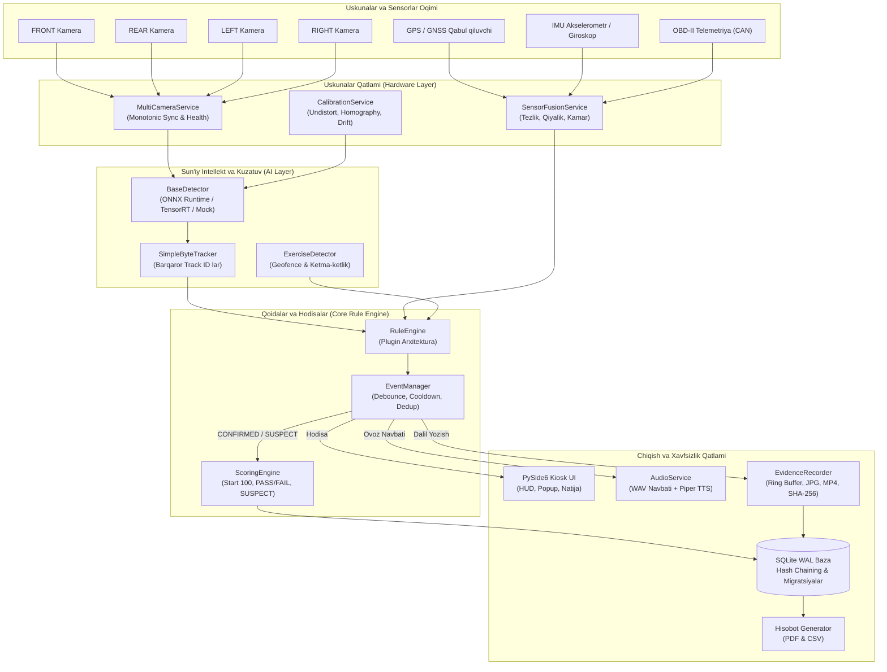
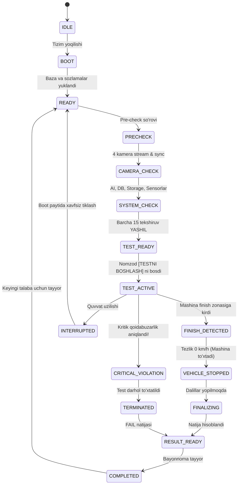
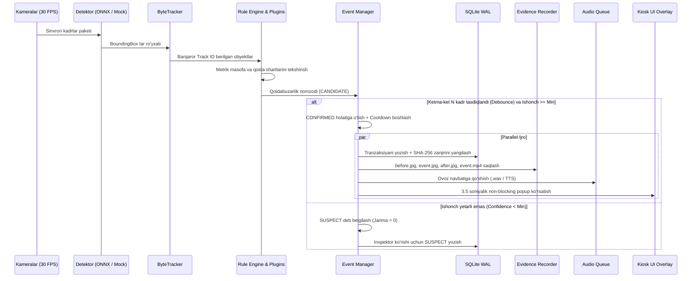

# TIZIM ARXITEKTURASI (ARCHITECTURE.md)

Ushbu hujjat "Standalone 4-Camera Offline AI Driving Training & Evaluation System" tizimining to'liq arxitekturasini, jarayonlararo aloqasini, ma'lumotlar oqimini va xavfsizlik modelini bayon qiladi.

---

## 1. Umumiy Konseptsiya va Tamoyillar
1. **100% Offline va Standalone**: Tizim hech qanday internetga, bulutli serverga yoki telemetriyaga bog'liq emas. 1 ta avtomobil = 1 ta sanoat kompyuteri = 1 ta SQLite baza.
2. **Qat'iy Holat Mashinasi (Strict State Machine)**: Barcha bosqichlar qat'iy tekshiriladi, ruxsatsiz o'tishlar istisno (exception) beradi.
3. **Multi-process Isolation**: AI inferens va kamera xizmati alohida, PySide6 Kiosk foydalanuvchi interfeysi alohida ishlaydi. Ular Watchdog orqali nazorat qilinadi.

---

## 2. Tizim Arxitekturasi Diagrammasi

---

## 3. Imtihonning Qat'iy Holat Mashinasi (Exam State Machine)

Tizimda `boolean` bayroqlar (flag) orqali holat saqlash qat'iyan taqiqlangan. Barcha o'tishlar `ALLOWED_TRANSITIONS` matritsasi bo'yicha ruxsat etiladi:

---

## 4. Qoidabuzarlik Konveyeri (Violation Pipeline)

Har bir kadr uchun tekshiruv konveyeri quyidagi zanjir bo'yicha amalga oshadi:

---

## 5. Kriptografik Xesh Zanjiri (Hash Chaining)
Ma'lumotlar bazasidagi har bir sessiya `session_hash` zanjiriga ega:
$$H_0 = \text{SHA256}(\text{SESSION\_START} + \text{ID} + \text{Time})$$
$$H_k = \text{SHA256}(H_{k-1} + \text{VIOLATION} + \text{RuleCode} + \text{Confidence} + \text{Time})$$
$$H_{\text{final}} = \text{SHA256}(H_{\text{last}} + \text{FINAL\_RESULT} + \text{Score} + \text{PASS/FAIL})$$

Agar kimdir SQLite bazasini tashqaridan ochib biror jarimani o'chirsa yoki ballni o'zgartirsa, qayta hisoblangan xesh ildizi `$H_{\text{final}}$` ga mos kelmaydi va tizim zudlik bilan tahrirlanganligini fosh qiladi.
